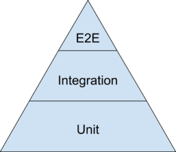
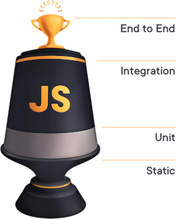

export { default as theme } from "./theme";

# Cypress Workshop

### April 16, 2019 | Syracuse JS Meetup | Syracuse CoWorks

---

# Testing at Large

Make sure portions of your app works as if a user was using it in production

---

# Types of Tests

- **Static Tests** - Also known as linters / formatters. (ESLint, Prettier, etc)
- **Unit Tests** - Testing a single component of a codebase in isolation (Mocha, Jest)
- **Integration Tests** - Testing multiple components together to confirm they "integrate" (Mocha, Jest)
- **End To End Tests** (E2E) - Testing the site in whole to check various workflows are correct (Selenium, Cypress)

---

# Philosophies of Testing

  
  

- Pyramid- Lots of Unit, some Integration, almost no E2E
- Trophy (Coined by Kent C. Dodds) - Some Static, some Unit, lots of integration, almost no E2E

---

# Almost no E2E?

- There's a small amount of tests that need to be E2E and need the full system up to test it.
- As they require the most infrastructure, they are almost the most brittle.

---

# Intro to Cypress

A powerful Testing framework for the modern JS developer.

Powered by NodeJS and Chrome. No more Java.

---

# Prerequisites for tonight

- Chrome (Firefox & Other browsers support coming in the future)
- NodeJS (Recommend at least Node 8.x or later)
- Text editor (Recommend VS Code for Intellisense features around Cypress)

---

# What we'll be testing

TodoMVC: A well known todo app.

Clone down the following repo from GitHub: [lannonbr/cypress-example-todomvc](https://github.com/cypress-example-todomvc)

---

# Setup

`npm install`

`node ./node_modules/.bin/cypress open`

---

# Let's dig into some code

---

# Break Time

Be back in about 10 minutes

---

# Part 2: Syracuse.io

Let's add some E2E tests with Cypress to Syracuse.io

---

# Resources & Next Steps

- Cypress Docs: https://docs.cypress.io/guides/
- Cypress Dashboard (Commercial Product): https://www.cypress.io/dashboard/
- Cypress in CI: https://docs.cypress.io/guides/guides/continuous-integration.html

---

# Thank you!

- @lannonbr on Twitter
- Slides at https://syrjs-cypress.netlify.com/
- Recording for this talk: https://www.youtube.com/watch?v=qZbW9WKKUl0
